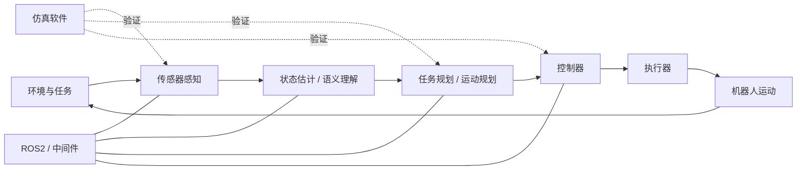

# 机器人学习总览

## 1. 学习目标

这个知识库的目标不是在两个月内从零造出完整机器人，而是建立“6 成了解”级别的机器人系统认知。

两个月后希望达到：

- 能说清 AMR、机械臂、四足、双足/人形机器人的基本组成；
- 能理解机器人系统中“感知 -> 规划 -> 控制 -> 执行”的主链路；
- 能跑通典型仿真或开源 Demo，并知道每个模块大概在做什么；
- 能解释 ROS2、仿真软件、模型文件、控制器、传感器之间的关系；
- 能持续维护一套自己的 Markdown 知识库，而不是只收藏资料。

一句话总结：

```text
先看懂系统链路，再跑通典型项目，最后把理解沉淀成可复用的知识库。
```

## 2. 总体学习主线

推荐主线：

```text
机器人基础 -> ROS2 -> 仿真软件 -> AMR -> 机械臂 -> 四足 -> 双足/人形 -> 感知与智能控制 -> 控制与强化学习 -> 总复盘
```

对应到本知识库：

| 阶段 | 目录 | 学习重点 |
|---|---|---|
| 基础认知 | [[01-机器人基础/01-机器人系统组成|01-机器人基础]] | 坐标系、自由度、模型文件、运动学、动力学、传感器、执行器 |
| 软件框架 | [[02-ROS2与机器人软件框架/01-ROS2总体理解|02-ROS2与机器人软件框架]] | Node、Topic、Service、Action、TF、Launch、RViz、ros2_control |
| 仿真环境 | [[03-仿真软件/01-仿真软件对比|03-仿真软件]] | Gazebo、MuJoCo、Isaac Sim / Isaac Lab 的适用场景 |
| 移动机器人 | [[04-AMR移动机器人/01-AMR总体架构|04-AMR移动机器人]] | SLAM、定位、路径规划、局部避障、底盘控制 |
| 机械臂 | [[05-机械臂/01-机械臂总体架构|05-机械臂]] | FK、IK、雅可比、轨迹规划、碰撞检测、MoveIt2 |
| 四足机器人 | [[06-四足机器人/01-四足机器人总体架构|06-四足机器人]] | 腿部自由度、足端运动学、步态、状态估计、关节控制 |
| 双足/人形 | [[07-双足与人形机器人/01-双足机器人总体架构|07-双足与人形机器人]] | 质心、支撑多边形、ZMP、平衡、全身控制 |
| 感知智能 | [[08-感知与智能控制/01-感知系统总览|08-感知与智能控制]] | 视觉、听觉、触觉、多模态任务理解 |
| 控制进阶 | [[09-控制与强化学习/01-控制系统总览|09-控制与强化学习]] | PID/PD、阻抗控制、MPC、WBC、RL、Sim2Real |
| 问题沉淀 | [[14-问题库/00-问题库总览|14-问题库]] | 报错、阻塞点、待深入主题、复盘经验 |

## 3. 机器人系统的一张总图



机器人系统可以粗略理解为：

```text
传感器把世界变成数据
算法把数据变成状态和目标
规划把目标变成可执行路径或动作
控制把路径或动作变成关节/电机命令
执行器把命令变成真实运动
```

更详细的架构图见 [[02-机器人系统总架构图]]。

## 4. 各方向的核心问题

| 方向 | 最先要想明白的问题 | 典型输出 |
|---|---|---|
| AMR | 机器人在哪里？要去哪里？中间有没有障碍？ | `/cmd_vel`、路径、地图、定位结果 |
| 机械臂 | 末端要到哪里？关节该怎么动？会不会碰撞？ | 关节轨迹、末端位姿、夹爪动作 |
| 四足 | 身体如何保持稳定？每条腿什么时候落脚？ | 足端轨迹、关节角、接触状态 |
| 双足/人形 | 质心是否在可支撑区域内？摆动腿如何落脚？ | 全身关节命令、平衡控制结果 |
| 视觉感知 | 图像里有什么？目标在哪里？与机器人坐标如何对应？ | 目标类别、框、分割、位姿、点云 |
| 听觉感知 | 人说了什么？对应什么机器人任务？ | 文本、意图、动作指令 |
| 触觉感知 | 是否接触？力多大？是否滑动？ | 接触状态、力/压强、抓取稳定性判断 |
| 智能控制 | 高层任务如何变成可执行动作？ | 目标、策略、动作序列、控制参考 |

## 5. 推荐学习节奏

每个主题都按这个节奏推进：

```text
概念速读 -> 跑通 Demo -> 拆解输入输出 -> 画链路图 -> 写入知识库 -> 记录问题
```

建议每周至少产出：

- 3 到 5 篇概念笔记；
- 1 到 2 篇实验或项目笔记；
- 1 篇周复盘；
- 若干条问题记录。

## 6. 入口文件

- 学习路线：[[01-两个月学习路线]]
- 系统架构：[[02-机器人系统总架构图]]
- 概念索引：[[03-核心概念索引]]
- 项目索引：[[04-开源项目索引]]
- 问题清单：[[05-问题清单与待深入主题]]

## 7. 当前阶段提醒

当前阶段优先追求“看懂主链路”和“跑通典型项目”，不要过早陷入公式推导、论文细节或源码逐行阅读。

判断一篇笔记是否合格，可以问自己 5 个问题：

- 这个概念解决什么问题？
- 输入是什么？
- 输出是什么？
- 它在机器人系统中处在哪一层？
- 我能不能用自己的话讲给别人听？
