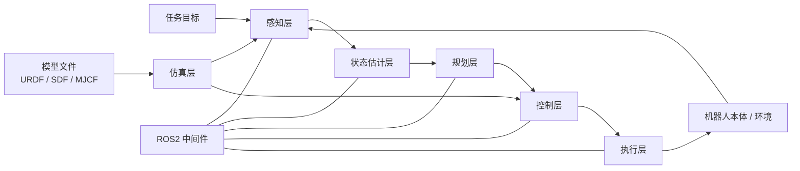
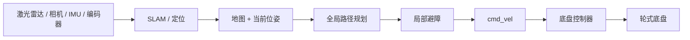
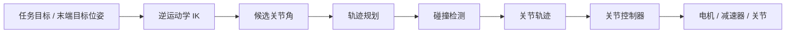
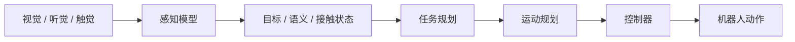
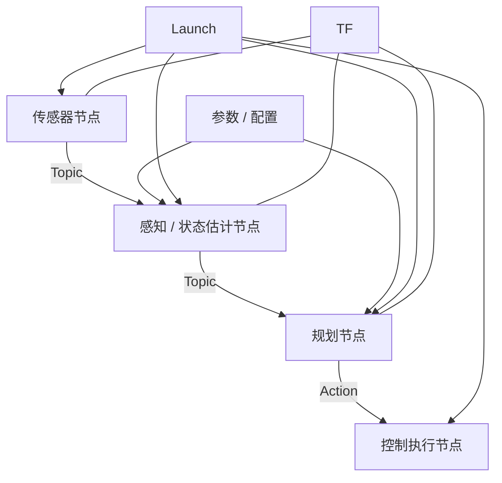

# 机器人系统总架构图

## 1. 一句话理解

机器人系统本质上是在闭环中不断完成：

```text
感知环境 -> 理解状态 -> 规划动作 -> 控制执行 -> 再次感知
```

不同类型机器人看起来差异很大，但主链路高度相似：区别主要在传感器、运动机构、控制对象和稳定性约束。

## 2. 通用系统架构



## 3. 各层职责

| 层级 | 解决的问题 | 常见输入 | 常见输出 | 典型概念 |
|---|---|---|---|---|
| 任务层 | 要做什么 | 人的命令、目标点、任务描述 | 任务目标、动作意图 | 任务规划、语音命令、多模态理解 |
| 感知层 | 环境里有什么 | 相机、雷达、IMU、编码器、触觉 | 图像、点云、障碍物、接触信息 | 目标检测、SLAM、点云、触觉 |
| 状态估计层 | 机器人和环境现在是什么状态 | 传感器数据、模型、历史状态 | 位姿、速度、地图、接触状态 | 里程计、定位、滤波、状态估计 |
| 规划层 | 应该怎么走或怎么动 | 目标、地图、约束、当前状态 | 路径、轨迹、足端落点、关节轨迹 | 路径规划、轨迹规划、步态规划 |
| 控制层 | 如何稳定执行规划结果 | 轨迹、状态误差、动力学模型 | 速度命令、力矩、关节目标 | PID/PD、MPC、WBC、阻抗控制 |
| 执行层 | 把控制命令变成物理运动 | 电流、力矩、位置/速度目标 | 轮子/关节/夹爪运动 | 电机、减速器、驱动器、关节模组 |
| 仿真层 | 在虚拟环境验证系统 | 机器人模型、场景、控制器 | 仿真传感器、状态、碰撞 | Gazebo、MuJoCo、Isaac Sim |

## 4. AMR 移动机器人链路



AMR 的核心问题是：

- 我在哪里；
- 地图是什么样；
- 目标在哪里；
- 中间有没有障碍；
- 最终如何输出到底盘速度。

相关入口：[[04-AMR移动机器人/01-AMR总体架构]]

## 5. 机械臂链路



机械臂的核心问题是：

- 末端要到哪里；
- 关节角如何求；
- 中间路径是否可达；
- 会不会碰撞；
- 如何平滑执行轨迹。

相关入口：[[05-机械臂/01-机械臂总体架构]]

## 6. 四足机器人链路


四足机器人的核心问题是：

- 身体姿态是否稳定；
- 哪些腿支撑，哪些腿摆动；
- 足端应该落在哪里；
- 关节如何配合身体运动；
- 接触变化时如何保持稳定。

相关入口：[[06-四足机器人/01-四足机器人总体架构]]

## 7. 双足与人形机器人链路


双足/人形机器人的核心问题是：

- 质心是否在可支撑范围内；
- 单脚支撑时如何保持平衡；
- 摆动腿如何落脚；
- 上半身、手臂、腰部如何配合；
- 多接触和动态运动如何控制。

相关入口：[[07-双足与人形机器人/01-双足机器人总体架构]]

## 8. 感知与智能控制链路



智能控制通常不直接替代底层电机控制，而是输出：

- 任务目标；
- 动作意图；
- 参考轨迹；
- 策略动作；
- 对环境和任务的语义理解。

相关入口：[[08-感知与智能控制/01-感知系统总览]]

## 9. ROS2 在架构中的位置

ROS2 不是某一个算法，而是把各模块连接起来的软件框架。



重点理解：

- Topic 适合连续数据流；
- Service 适合一次性请求-响应；
- Action 适合可取消、可反馈的长任务；
- TF 负责坐标系关系；
- Launch 负责组织多个节点启动；
- ros2_control 负责连接控制器和硬件接口。

相关入口：[[02-ROS2与机器人软件框架/01-ROS2总体理解]]

## 10. 后续阅读顺序

建议按以下顺序阅读本知识库：

```text
[[00-机器人学习总览]]
-> [[01-两个月学习路线]]
-> 本文
-> [[03-核心概念索引]]
-> 各专题目录
-> [[05-问题清单与待深入主题]]
```
